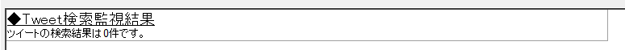
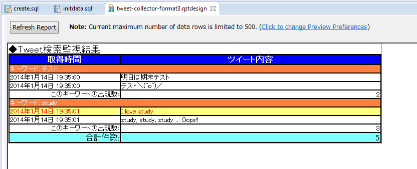

############################################
Eclipse BIRTによる動的レポートの生成
############################################

1. はじめに
===============================

本章では、BIRTを利用してデータソースを読み込み、動的なレポートを生成する方法を述べる。
また、細かいレイアウトを指定する方法について説明する。

2. 作成するシステム
===============================

2章と3章とを使い、Tweet-Collectorというシステムを作成することを考える。
このシステムの仕様は以下の通りである。

- Tweet-Collectorは一定時間ごとにTwitterをある単語(キーワード)で検索し、それをデータベース(MySQL)に保持する
- データベースの内容をPDF形式で吐き出すことができる
- PDF形式で吐き出す場合に、吐き出す期間を指定できる

この内、データを収集して保存する部分は今回は割愛する。
(データベースにはレポートを出力するために十分なデータが既に入力されているものとする)

3. データベースの内容
===============================

今回のシステムのデータベース(スキーマ)名はtweet_collectorとする。
レポート表示に用いるテーブルは以下の2つである。

- "search"テーブル: 検索の履歴を保持する
- "result"テーブル: 検索結果を保持する

これらのデータベースとテーブルは以下のSQLで作成される。

(※サンプルなのでDB設計の良し悪しには言及しない方向でお願いします。)
::

  create database tweet_collector default character set utf8;
  
  use tweet_collector;
  
  create table search (
      SEARCH_UUID char(36) NOT NULL -- 検索実行時に発行されるUUID
    , TIME timestamp NOT NULL       -- 検索の実行時間
    , KEYWORD varchar(255) NOT NULL -- 検索を行ったキーワード
    , PRIMARY KEY(SEARCH_UUID)
  );

  create table result (
      SEARCH_UUID char(36) NOT NULL -- 検索実行時に発行されるUUID
    , SORT_ORDER integer NOT NULL   -- 結果の表示順序
    , MESSAGE varchar(255) NOT NULL -- 検索したツイートの内容
    , PRIMARY KEY(SEARCH_UUID, SORT_ORDER)
  );

  

このシステムの検索部分はこのテーブルを次のように活用する。

- 検索を一度実行したら、データの取得の有無に関わらずにsearchテーブルに検索した事を登録する
- 検索結果はresultテーブルに登録される。searchとresultとの結びつけはSEARCH_UUIDである
  (話を単純にするため外部キーを貼ってないが、外部キーを貼る設計としても差し支えない)

4. MySQL Data Sourcesの利用
===============================

この節では、外部のデータソースをBIRT内で利用する方法を説明する。

また、MySQLの設定については解説しないが、以下の状況を仮定する
(必要によっては適時読み替えて進めること)。

- MySQLがlocalhostにインストールされている
- ポートはデフォルトポート(3306)を利用するものとする
- tweet_collectorデータベースが作成されている
- tweet_collectorにアクセスできるユーザー/パスワードの組がある

今回はテスト環境として、以下のSQLでユーザー/パスワードを作成した。

::

  grant all privileges on tweet_collector.* to tweet_collector@'localhost' identified by 'tweet_tweet_collector' with grant option;

4.1. Connector/Jの準備
-------------------------------

BIRTでMySQLを使う場合、JDBC Driver(Connector/J)が必要になる。
以下の手順で先にjarファイルをダウンロードしておくこと。

1. `Connector/Jのダウンロードページ`_ にアクセスする
2. Select Platformで "Platform Independent" を選択する
3. 必要なArchiveをダウンロードする(zipでもtarでもどちらでも良い)
4. Archiveを解凍し、jarファイルをどこかに配置しておくこと

.. _`Connector/Jのダウンロードページ`: http://dev.mysql.com/downloads/connector/j/

4.2. データソースの準備
-------------------------------

まずはデータソースを定義する。

.. image:: image/02/data-sources-01.png

"Data Explorer > DataSourcesを右クリック > New Data Source" を選択してDataSourceの定義ウインドウを開く。

.. image:: image/02/data-sources-02.png

BIRTで利用できるデータソースとして、上記ウインドウに示してあるデータが利用できる。
ここでは、MySQLのデータを使うので、JDBC Data Sourceを選択して、Data Source NameをMySQL(任意)とする。

選択後、Nextを押すと、次のようなJDBCの接続設定を行う画面が現れる。

.. image:: image/02/data-sources-03.png

初回のみ、Connector/Jのjarファイルにパスを通す必要がある。
以下の手順で4.1.で展開したjarファイルにパスを通す。

1. 画面左下の"Manage Drivers"ボタンを押す
2. JAR Filesタブ内のAddボタンを押す
3. 小節4.1.で解凍したjarファイルを選択し"開く"を押す
4. 中央のテーブルに新しく行が追加されたことを確認して、OKボタンを押す

上記の設定後、Driver Classのコンボボックス内に"com.mysql.jdbc.Driver"が増えているはずなので、それを選択する。

その後、URL, UserName, Passwordを設定し"Test Connection"ボタンを押す。
成功した場合、"Connection successful"というウインドウが表示される。
今回仮定した環境の場合、入力は以下のようになる。

.. image:: image/02/data-sources-04.png

"Connection successful" の状態でFinishを押すことで、このレポートで利用するデータソースを定義できる。

**補足: 別環境への導入**

今回はlocalhost向けの設定を行ったが、開発DB環境と本番DB環境が異なる場合が普通である。

そのため、別の環境で使うためにはどのようにすればよいのか疑問に思った人もいるはずなので、簡潔に答えを書いておくと、
この設定は全てXML Source内に記述されているので、そこを書き換えることで対応できる。

開発と本番環境を切り分けるには、テスト時内容と完全一致のsedを記載する、
Chefなどのテンプレートビルドによるデプロイなどで環境の違いを吸収する方法が考えられる。

.. image:: image/02/data-sources-05.png

4.3. データセットの定義
-------------------------------

小節4.2.で設定したデータソースから、どのようなデータを取得するかを設定する。

"Data Explorer > Data Setsを右クリック > New Data Set"をクリックし、どのデータソースからデータを取得するかを選ぶ。
先ほど登録したMySQLがあるので、これを選び、Data Set Nameに適切な名前(ここでget-allと名づけた)をつけてNextをクリックする。

次に進むと、DataBaseからどのような情報を取得するかのSQLを書くように指示される。
ここでは単純に全データを取得するSQLを記載する。

なお、記述にあたり、画面左のテーブル・カラム情報をドラッグアンドドロップすることで、多少記述が楽になる。

.. image:: image/02/data-sets-02.png

SQLを記述して"Finish"を押すと、下記のEdit Data Setのウインドウが開く。
ここでは特に何もせず、OKボタンを押す。

すると、Data Explorerの中のData Sets内に"get-all"という名前のデータセットが追加されているはずである。

4.4. データセットの利用
-------------------------------

このデータセット"get-all"をLayout内にドラッグ＆ドロップすると、取得した行全てを表示するテーブルが作られる。

あとはほぼグリッドと同様の方法で行・列を編集することができる
(なお、テーブルとグリッドの違いはデータセットを繰り返す構造かそうでないか。テーブルは繰り返す、グリッドは固定)。

.. image:: image/02/data-sets-05.png

単純なデータを入れてPreviewを見ると、データベースからデータを取得してレポートに表示できていることが分かる。

::

  insert into search (SEARCH_UUID, TIME, KEYWORD) values ('965a3b14-7d07-11e3-84fc-782bcb93b38f', '2014/1/14 19:35:00', 'テスト');
  insert into search (SEARCH_UUID, TIME, KEYWORD) values ('b8af083a-7d07-11e3-84fc-782bcb93b38f', '2014/1/14 19:35:01', 'study');

  insert into result (SEARCH_UUID, SORT_ORDER, MESSAGE) values ('965a3b14-7d07-11e3-84fc-782bcb93b38f', 0, '明日は期末テスト');
  insert into result (SEARCH_UUID, SORT_ORDER, MESSAGE) values ('965a3b14-7d07-11e3-84fc-782bcb93b38f', 1, 'テスト＼(^o^)／');

  insert into result (SEARCH_UUID, SORT_ORDER, MESSAGE) values ('b8af083a-7d07-11e3-84fc-782bcb93b38f', 0, 'I love study');
  insert into result (SEARCH_UUID, SORT_ORDER, MESSAGE) values ('b8af083a-7d07-11e3-84fc-782bcb93b38f', 1, 'I hate study');
  insert into result (SEARCH_UUID, SORT_ORDER, MESSAGE) values ('b8af083a-7d07-11e3-84fc-782bcb93b38f', 2, 'study, study, study ... Oops!! ');

.. image:: image/02/data-sets-06.png

ここまでの成果はTweet-Collector/tweet-collector-format1.rptdesignに記述されている。

5. Sub-Group Layout
===============================

テーブルから不要な列を削除しスタイルの調整を行うことで、
以下のような結果を得ることができるようになった。

しかし、取得時間や検索キーワードについては各行に同じ情報が出力されており、
これをまとめて表示することで、レポートの質を上げたい。

データセットの結果を集約する方法にGroupという概念があるため、それを説明する。

5.1. Group
--------------------------------

テーブルには、Header, Detail, Footerという概念がある。
下図の一番上の行がHeader, 一番下の行がFooter, そして真ん中のコンテンツを表示する行がDetailである。

TableのDetailの行のどこかにはDataが入っている必要がある。
Data Setからドラッグ＆ドロップしてきた場合は、適切なデータセットにバインドされたテーブルを作ってくれるので、
これを編集すると楽である。

さて、Detailを右クリックすると"Insert Group"という内容が出てくるので、これをクリックする。
すると、以下の用に「データをグループ化する条件設定」のウインドウが出てくるので、以下の設定を行う。

- NameをKeywordGroupに設定する
- Group OnからKEYWORDを設定する
  (これで、同じキーワードの要素がグループ化される)
- SortingからAddを選び、KeyにTIMEとSORT_ORDERを選ぶ。
  (グループ化した後の表示の並び順を決める)

設定を行うと、以下のような表示になるので、OKを押す。

.. image:: image/02/sub-group-03.png

すると、Detail内にさらにもう一段ネストした形でGroupが現れる。

これを編集し、Groupごとの表示を行うようにするには、以下の処理を行う。

- 検索キーワードの行を削除する
- subheaderのData [KEYWORD]をダブルクリックし、Expressionを "キーワード: " + dataSetRow["KEYWORD"] に変更する。
- Data [KEYWORD]の行をマージする
  (方法: 右のセルを選択後、Shiftを押しながら左キーを押し、"右クリック > Merge Cells"をクリック)
- subheader用のstyleを作成し、subheaderに適用する
- subheader内のcellにcell-borderを適用する
- subfooterを削除する

以上の処理を行うと、次のようなレポートが生成される。

.. image:: image/02/sub-group-05.png

これはネスト(GroupのGroupを使う、など)することもできる。

5.2. 集約関数
--------------------------------

サブグループ化が行われたのであれば、(SUMやCOUNTなどによる)集計を行ってレポートに表示したい。

これも、テーブル内のデータに用意された集約関数を利用すれば実現できる。

以下の手順で新しいデータ/集約条件を追加する。

1. テーブルを選択し、"Property Editor > Binding"タブを開く
   (補足: 上手く表示されない場合ケースがあったので、その場合はファイルを閉じて開きなおしてみてください)
2. 右のボタンの"Add Aggregation"を選択する
3. 集約条件を設定する。
   ここでは、以下の条件を設定している。
   
   - データ項目名・表示名は "KEYWORD_COUNT"
   - 集約関数はCOUNTで、戻り値はInteger型
   - COUNTの項目はKEYWORD列
   - 計算はKeywordGroupごとに行う
     (全体の計算を行いたい場合はTableを指定すればよい)

.. image:: image/02/sub-group-09.png

4. 集約条件を使う場合、DataをInsertしてrow["KEYWORD_COUNT"]を指定する
   (Expressionの"fx"内から選択することも可能。下図を参考)

.. image:: image/02/sub-group-10.png
.. image:: image/02/sub-group-11.png

以上の集約結果を利用して、サブコマンドを編集すると、以下の結果が得られる。

ここまでの成果はTweet-Collector/tweet-collector-format2.rptdesignに記述されている。

6. 条件装飾
===============================

レポートに出力する際に、データの内容によって出力を変更したい場合がある。
例えば、以下のようなケースである。

- ある条件を満たしている場合のみ文字の装飾を変える
- ある条件を満たさないデータを表示しない
- データの件数が0件の場合と1件以上の場合とで、異なるデータを出力する

Eclipse-BIRTでは、これらの処理をプログラムを書かずに記述することができる。

6.1. Highlights
--------------------------------

ここでは、条件として"love"(大文字小文字を区別しない)が
ツイート内容に含まれている行を以下のように装飾したいとする。

- 行の文字色を赤色に変更する
- 行の背景を薄黄色に変更する

このような処理を行いたい場合、Highlights機能を利用する。
Hightlights機能の利用方法は以下の通りである。

1. 条件装飾を行いたい範囲(ここでは、データを表示する行)を選択する。
   (行全体ではなく、セル単体を装飾したい場合はここで **セル** を選択する。
   セル内の要素を選択すると、微妙に隙間が出るので注意すること！)

2. "Property Editor > Hightlightsタブ > Addボタン" を押す

3. Highlightsの装飾内容と装飾条件を指定する。
   今回のケースであれば下記の通りに指定すればよい。

4. Previewを行い、装飾が行われているかを確かめる。
   
   今回のケースであれば下記の通り、
   "love"がツイート内容に含まれる行だけが装飾されていることが分かる。

6.2. Visibility
--------------------------------

ここでは、条件として"hate"(大文字小文字を区別しない)が
ツイート内容に含まれている行をレポートに表示したくないとする。

このような処理を行いたい場合、Visibility機能を利用する。
Visibility機能の利用方法は以下の通りである。

1. 表示の有無を条件で切り替えたい要素(ここでは、データを表示する行)を選択する。

2. "Property Editor > Propertiesタブ > Visibilityタブ" を押す

.. image:: image/02/decoration-05.png

3. "Hide Element"にチェックを入れる
4. Detailの中に"画面上に表示しない条件"を記述する。
   ここの内容は基本的にJavaScriptで記載する。
   
   (Javaのクラスも利用はできる)
   
   Expressionの結果として真偽値を返す必要がある点に注意する。
   (そのため、ここでは真偽値を返すRegExp#testを利用している)

5. Previewを行い、表示・非表示の有無を確かめる。
   
   今回のケースであれば下記の通り、
   "hate"がツイート内容に含まれる行だけが表示されていないことが分かる。

ただし、これはあくまで **表示されていない** だけである点に注意する。
その証拠に、"キーワード: study"の出現数は表示される前と変わらず3のままである。

これらの集計結果を正確に求めたい場合は、データソースの取得時に加工する必要がある。

6.3. 0件/それ以外の表示切替
--------------------------------

Visibilityを応用することで、0件とそれ以外の場合の表示を切り替えることができる。
具体的な方法は以下の通りである。

1. データソースに件数を取得するクエリを設定する
2. 0件の場合に表示する文言(Data)を追加する
3. 表に件数が0の時に非表示となるVisibilityを設定する

これらは、以下の手順で実行可能である。

1. "Data Explorer > Data Sets > get-all" をコピー＆ペーストする
   (get-all1という名前のDataSetsができる)
2. F2ボタン、あるいは"Property Editor > General" から名前を "get-all-count"に変更する
3. Queryを以下のように変更する
   (データではなく、件数を取得するように変更)。

::

  select
      count(*) as cnt
  from search
  inner join result
    on search.SEARCH_UUID = result.SEARCH_UUID

4. OKボタンを押し、"Edit Data Set"を閉じる。
5. Paletteから、0件のメッセージを出力したい箇所(表の前後のいずれか)にDataをドラッグ＆ドロップする。
6. 以下の内容でData Bindingを作成する。ここのExpressionは0件の場合に表示する文言である。

.. image:: image/02/decoration-10.png

7. 今追加したDataを選択し、"Property Editor > Bindingタブ > Data Set" から get-all-count を選択する。
   この時、現在登録されているBindingをクリアするかを問われるので、"No"を選択する。

8. get-all-countの全てのカラムが追加される。

9. "Property Editor > Properties > Visibility" を選び、非表示条件を設定する。
   今回の場合、0件より大きければメッセージを非表示にする。

10. 同様に、表そのもののVisibilityを設定する。
    この場合は、0件のときのみ非表示。
    
    テーブルの件数を判定するには、Totalヘルパを利用する(理由は補足2を参照)

11. Previewを行い、表示を確かめる。
    データが存在する場合はこのメッセージが表示されない。
    
    一方で、データが0件の場合は、このメッセージが表示される。

ここまでの成果はTweet-Collector/tweet-collector-format3.rptdesignに記述されている。

補足1: Dataを利用する理由
^^^^^^^^^^^^^^^^^^^^^^^^^^^^^^^

BIRTでデータセットを利用する場合、
あるオブジェクトがどのデータセットを使うかをbindする必要がある。

そして、たんなるLabelはDataをバインドできない。

データソースの内容によって動的にデータを変更したい場合はDataオブジェクトを使用する必要がある。

補足2: 表の件数について
^^^^^^^^^^^^^^^^^^^^^^^^^^^^^^^

ここで利用しているTotalクラスは集約機能のヘルパ関数である
(公式のリファレンスが発見できなかったが、 `IBMが公表している情報`_ がある。
見つけ次第追記する)。

BIRTの仕様から、 **1つのオブジェクトに紐付けできるDataSetは1つである。**
そして、Tableは表の内容であるDataSetと紐付いている。

Computed Column(SQLの結果を元に計算を行い、 **得られた行に結果を付与する** 仕組み)を使って、
DataSetの累計数を取得することは可能であるが、
この場合、 **0件のときにはレコードが1件も取れないため、Computed Columnの値が不定になってしまう** 。

レコードが0件の場合のComputed Columnの扱いがWindows版とLinux版とで一部異なることを確認している
(Windowsではnull判定で0件のケースを確認できたが、Linuxではそうは行かない結果が得られた)ので、
この情報をあてにするのは難しい。

以上の理由から、集約機能のヘルパ関数であるTotalを用いないと0件の判定を行うことができないため
Totalクラスを利用したVisibilityの判定を行っている。

なお、0件の場合にcountを用いたSQLを利用したが、
データが適切にバインドされているならば hide条件: Total.count() > 0 で判定可能(7.2で説明している)。

.. _`IBMが公表している情報`: http://publib.boulder.ibm.com/infocenter/radhelp/v7r0m0/index.jsp?topic=/org.eclipse.birt.doc/birt/birt-24-4.html

7. レポート生成時の引数
===============================

これまであるデータソースを元にしてレポートを加工してきたが、
出力するレポートに対して引数を与えてレポートを作成したい場合がある。

例えば、レポートのデータの期間、日付情報やレポートのキーワードがそれに当たる。

ここでは、レポートの引数を利用する方法を見ていく。

7.1. 引数の設定
------------------------------

これまでのTweet-Collectorは、全ての検索結果を表示していた。
ここでは、引数で指定したキーワードで検索された結果だけを表示したいとする。

レポート生成時に引数を指定するためには、
"Data Explorer > Report Parameters"に値を追加すればよい。

"Report Parametersで右クリック > New Parameter"をクリックすると、パラメータを編集するダイアログが表示される。
今回は、以下のようなパラメータの設定を行う。

この設定を行った後、PreviewやRunによる書き出しを行おうとすると、
次のような入力ダイアログが表示される。

ここで入力した引数は、レポートの生成時に利用される。
(この時点では設定しただけであり、まだレポートには反映されない)

この内容をそのまま利用したい場合(例えば、文言を引数で受け取りたい場合など)は
"Data Explorer > Report Parameters"の中の要素をメイン画面にドラッグ＆ドロップすれば利用できる。
(Expression内で **params["パラメータ名"]** と参照することで利用可能である)

引数の設定を行った場合、reportファイルと同じ場所に **[reportファイル名].rptconfig**
という名前のファイルが作られる(中身はXMLファイル)。
デフォルトの入力値などは、このファイルに記載されている。

7.2. 引数とデータソースの連携
------------------------------

レポートの生成時に引数を与えることはできるようになったため、
データソースの取得時の条件にこの引数を与えたい。

**しかし、データソースから取得する部分(Query)に直接引数を与えることはできない。**

これを解決するためには、DataSetのFilterという機能を利用する。
この機能を利用すると以下の手順で処理を行ったデータソースを利用可能になる。

1. まずQueryを発行しデータソースからデータを取得する
2. 1で取得したデータから、特定の条件を満たすものだけを選ぶ

そのため、ここではget-allに対して、Filtersを作成する。
手順は以下の通りである。

1. データセット(ここではget-all)を選び、Edit画面を表示する
2. 左のリストからFiltersを選び、右のNewボタンを押す

3. Filterの条件(データソースとして取得する条件)を記載する。
   ここでは、"KEYWORDの値がレポートのkeyword引数の中身と一致する"ことを条件とする。

4. OKを押し、左のリストからPreview Resultsを見る。
   Filterの条件に一致するもののみが結果として得られていることが分かる。
   
   (ここのPreviewでは、引数のデフォルト値として設定した値を使った結果を見せてくれる)

- Filterの条件設定前

- Filterの条件設定後

get-all-countはTotalクラスを利用すれば不要となる。
以下の手順でTotalクラスを利用する。

1. Data: TWEET_EMPTY_MESSAGEのData Setとしてget-allを指定する。
   (この時、TWEET_EMPTY_MESSAGEを削除しないように注意)
2. 利用するデータ(KEYWORD)以外を全て削除する

3. Visibilityに次の値を設定する。
   (最初の引数はTotal.countの引数として機能する)

以上の手順で引数のキーワードを表示するレポートが完成した。
Previewの結果を以下に示す。

- 引数が"テスト"の場合

- 引数が"study"の場合

- 引数が"hogehoge"の場合

.. image:: image/02/argument-13.png

ここまでの成果はTweet-Collector/tweet-collector-format4.rptdesign (およびrptconfig)に記述されている。

8. その他の小技
===============================

ここまでの流れの中で、幾つか紹介仕切れなかった情報があるので、
簡潔にではあるが紹介する。

8.1. Odd-Even Table
------------------------------

Webのレイアウトとして、テーブルの偶数奇数をそれぞれ別の色で塗りつぶすレイアウトが採用される場合がある。
Eclipse BIRTの場合、これはHighlightsとrow.__rownumを利用する。

Highlightsに対して、以下のようなルールを追加する。
(左辺にrow.__rownum % 2のように数式を入れるのがコツである)

8.2. 改ページ
------------------------------

1つのレポートの中に複数の要素（例えば、表紙、目次、内容に分かれている場合など）がある場合、
それらの区切りごとに改ページを行いたい場合がある。

改ページを行うには、"Property Editor > Properties > Page Break"を設定する。

Page Breakでは、Before(オブジェクトの直前), After(オブジェクトの直後), Inside(オブジェクトの途中)
でAuto, Avoid(, Always)が指定できる。

空のLabelを入れて、その前後どちらかでPageBreakすると分かりやすいレポートの雛形が作成できると思う。

テーブルの場合、何行表示したら改行をするかの選択(Page Break Interval)が指定できる。

これらの要素を適切に組み合わせることで、比較的自由なレポートを作成することができる。
なお、改ページはPreviewには現れないため、実際にRunをさせて確かめてみること。

実際にPageBreakIntervalを25にして、odt形式に出力した結果を以下に示す。
25行内容を出力した後に改ページが行われ、残りのデータが次ページに出力されていることが分かる。

.. image:: image/02/appendix-03.png

ここまでの成果はTweet-Collector/tweet-collector-format5.rptdesign (およびrptconfig)に記述されている。

9. おわりに
==============================

Eclipse BIRTとデータソース・条件を利用してレイアウトの自由なレポートを作成する方法を述べた。
次の章では、ここで作成したTweet-CollectorをTomcatで動かす方法を説明する。

参考文献
==============================

- `BIRT Project公式ページ`_
- `Wikipedia - BIRTプロジェクト`_

.. _`BIRT Project公式ページ`: http://www.eclipse.org/birt/phoenix/
.. _`Wikipedia - BIRTプロジェクト`: http://ja.wikipedia.org/wiki/BIRT%E3%83%97%E3%83%AD%E3%82%B8%E3%82%A7%E3%82%AF%E3%83%88

