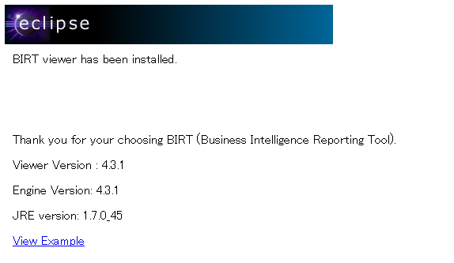
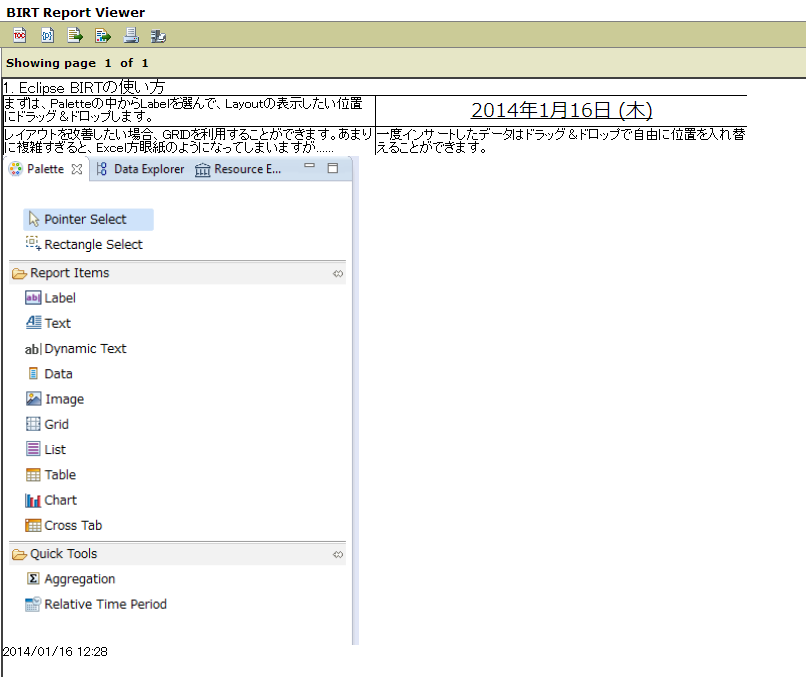

############################################
Eclipse BIRTプラグインの利用
############################################

1. はじめに
===============================

ここまでに、Eclipse BIRTとデザイナ、さらにはデータソースを利用してレポートを作成する方法を述べた。
しかし、実際にレポートを出力する際にこれらの状況を再現するのは現実的ではない。

単にレポートを取得する場合、様々な方法が考えられるが、
現時点で手軽な方法の1つにWebサーバーにアクセスして(動的にレポートを作成した上で、)
レポートをダウンロードするという方法がある。

最初に述べたとおり、Eclipse BIRTはJavaEEに基づいた機能を提供しており、
その中にはServletコンテナとWebサーバーを利用してWeb経由でレポートを出力・ダウンロードする機能もある。

本稿ではApache Tomcat7とEclipse BIRTランタイムを利用して、
レポートのダウンロードサーバーを構築する手順と、その利用方法を説明する。

2. 環境構築の準備
===============================

ここではLinuxの上にTomcat7とBIRTランタイムを配置する。
なお、ここではTomcatやLinuxのコマンドについては特に解説しない。
また、最小限のコマンドのみを記載する
(例えば、Tomcatを起動するサービスを作るなどはしない)。

検証環境では以下の環境を使用しているが、必要に応じて読み替えて利用すること。

(Ubuntuでは、apt-getを利用してTomcatを取得してくるなどでも良いし、
好きなサーブレットコンテナを利用しても良い。
ただし、検証はTomcatでしか行っていない)

.. list-table:: 表2.1. 検証に利用したリソース一覧
   :header-rows: 1

   * - 項目
     - Version/概要
     - URL
   * - OS
     - Fedora19 (Win7上のvagrant + Virtual Box)
     - https://dl.dropboxusercontent.com/u/86066173/fedora-19.box
   * - サーバーのIPアドレス
     - 192.168.222.222
     - 
   * - サーバーのポート番号
     - 8080
     - 
   * - Apache Tomcat
     - Tomcat7.0.47
     - http://ftp.jaist.ac.jp/pub/apache/tomcat/tomcat-7/v7.0.47/bin/apache-tomcat-7.0.47.zip
   * - BIRTランタイム
     - Version 4.3.1
     - http://ftp.yz.yamagata-u.ac.jp/pub/eclipse//birt/downloads/drops/R-R1-4_3_1-201309181142/birt-runtime-4_3_1.zip
   * - Connector/J
     - Version 5.1.27
     - http://cdn.mysql.com/Downloads/Connector-J/mysql-connector-java-5.1.27.zip

また、何も設定が行われていない場合は以下の項目を最初に実施する必要がある。

1. Firewall Portの開放
2. Javaランタイムのインストール

まず、Fedora19を利用する場合はTomcatがデフォルトで利用するポート8080を開く必要がある。
(管理者権限のあるユーザーで)以下のコマンドを実施すること。

::

  sudo firewall-cmd --permanent --add-port=8080/tcp
  sudo service firewalld restart

その後、Javaを実行するためのランタイムをインストールする。
Fedora19なら以下のコマンドを実行すると良い。

::

  sudo yum update
  sudo yum -y install java-1.7.0-openjdk.x86_64

3. 環境構築
===============================

BIRTランタイムを利用するため、以下の作業を行う。

1. Javaをインストール
2. Tomcatをインストールする
3. TomcatのappBaseにBIRTランタイムを配置する
4. TomcatのlibにConnect/Jのjarファイルを配置する

今回は以下の設定とした。

::

  # Tomcatのインストールディレクトリパス
  /usr/local/apache-tomcat
  
  # appBaseのディレクトリパス
  /usr/local/apache-tomcat/webapps
  
  # libのディレクトリパス
  /usr/local/apache-tomcat/lib

インストール、ファイルの配置はzipファイルを解凍した結果をコピーするだけでよい。
検証に使ったファイルを用いるならば、それぞれ以下のパスにファイルが配置されているはずである。

::

  ls /usr/local/apache-tomcat/webapps/birt.war
  ls /usr/local/apache-tomcat/bin/startup.sh
  ls /usr/local/apache-tomcat/lib/mysql-connector-java-5.1.27-bin.jar

環境構築の終了後、Tomcatを起動させる。

::

  sudo /usr/local/apache-tomcat/bin/startup.sh

起動後、以下のURLにアクセスして画面が正しく表示されれば成功である。

URL: http://192.168.222.222:8080/birt/

4. 基本的な使い方
===============================

4.1. Viewer
-------------------------------

上記の画面に"View Example"というリンクがある。
そのリンクをクリックすると以下のような画面が表示される。

(URL: http://192.168.222.222:8080/birt/frameset?__report=test.rptdesign&sample=my+parameter )

BIRTランタイムはReportの出力結果のViewerとしての機能を持つ。
Viewerの操作は左上のボタンと右のページ送りを利用する。
マウスオーバーにより説明が表示されるので参考にするとよい。

一度でもBIRTのindexにアクセスすると、webappsの以下にbirtディレクトリが作成される。
その中身は以下のようになっている。

::

  $ ls /usr/local/apache-tomcat/webapps/birt
  CancelTask.jsp  documents  index.jsp  logs  report  scriptlib  test1.rptdesign  test.rptdesign  webcontent  WEB-INF

ここで重要なのは以下の2点が推測できる点である。

- http://192.168.222.222:8080/birt/ で表示されていたのは、index.jspの内容である
- 作成したレポートデザインファイル(rptdesign)ファイルをこのディレクトリにデプロイする

そこで、実際に以下のことを行ってみる。

- /usr/local/apache-tomcat/webapps/birt 以下に1章で作成したファイル(example1-1.rptdesing)と画像ファイルをコピーする
- 次のURLにアクセスする: http://192.168.222.222:8080/birt/frameset?__report=example1-1.rptdesign

すると、以下のような画面が得られる。

この事から、以下のことが分かる。

- レポートをWebサーバーでダウンロードしたい場合は、"[appBase]/birt/" 以下にレポートのデザインファイル(とコンフィグファイル)を置く
- 自作のレポートをViewerで見たい場合、"[サーバー]/birt/frameset?__report=[レポートファイル名].rptdesign" にアクセスする

ちなみに、レポートの引数が必要な場合はアクセスしたときにダイアログで引数を要求される。
ここで入力した情報はsessionIdと共に保持される。

4.2. URLによるダウンロード
-------------------------------

Viewerの左から4番目のアイコンボタン("Export Report")を押すと、以下の画面が表示される。

このウィザードでダウンロードしたい形式を選択し、OKボタンを押すと実際にファイルがダウンロードされる。
実際にPDFでファイルをダウンロードした時に発行されたURLは以下の通りである。
(ChromeのDeveloper ToolsなどでリクエストしたURLを追うと分かりやすい)

- http://192.168.222.222:8080/birt/frameset?__report=test.rptdesign&sample=my+parameter&__sessionId=20140116_123544_443&__dpi=96&__format=pdf&__pageoverflow=0&__asattachment=true&__overwrite=false

上記のURLを解析すると、ファイルをダウンロードするのに最低限必要なパラメータが分かる。
それは以下の通りである。

- __format: どの形式のファイルを取得するか
- __asattachment: true固定
- __overwrite: false固定
- レポートで設定した引数: レポートに渡したい値

これらを理解することで、例えばcurlコマンドを利用してレポートのダウンロードが可能になる。
例えば、以下のコマンドを発行すればよい。

::

  curl -s -L "http://192.168.222.222:8080/birt/frameset?__report=test.rptdesign&__format=pdf&__asattachment=true&__overwrite=false&sample=HELLO" > test.pdf

このコマンドを実行することで、カレントディレクトリに以下のようなPDFファイルがダウンロードできた。

5. データソースの書き換え
===============================

サーバー環境に配置すると、データソースの状況を変えなければいけないことがある。
今回作ったtweet-collector-format5.rptdesignの場合を例に説明すると、
44行目前後に以下の記述が見つかるので、これを書き換える。

::

  <property name="odaDriverClass">com.mysql.jdbc.Driver</property>
  <property name="odaURL">jdbc:mysql://localhost:3306/tweet_collector</property>
  <property name="odaUser">tweet_collector</property>
  <encrypted-property name="odaPassword" encryptionID="base64">dHdlZXRfdHdlZXRfY29sbGVjdG9y</encrypted-property>

- odaURL: JDBCが接続するデータベースのURL
- odaUser: データベース接続時のユーザ名
- odaPassword: base64で暗号化されたパスワード

base64で暗号化した内容は、以下のコマンドで知ることができる。
"-n"オプションを忘れると、改行まで含む内容がbase64 encodeされるので注意すること。

::

  echo -n [パスワード] | base64

ここでは試しに、Visual VM上のLinuxから開発用のWin7のmysqldに接続してみる。

1. Win7上にのmysqldに新たなユーザー・パスワードを追加

::

  -- セキュリティ上、非推奨だがテスト用
  grant all privileges on tweet_collector.* to twcol@'%' identified by 'test' with grant option;

2．Fedoraから、以下のコマンドで接続確認(Option)

::

  -- mysqlが入っていない場合は yum などでインストールするとよい
  mysql -u twcol -ptest -h [Win7のIPアドレス]

3. tweet-collector-format5.rptdesignの44行目前後を以下のように書き換える

::

  <property name="odaDriverClass">com.mysql.jdbc.Driver</property>
  <property name="odaURL">jdbc:mysql://[Win7のIPアドレス]:3306/tweet_collector</property>
  <property name="odaUser">twcol</property>
  <encrypted-property name="odaPassword" encryptionID="base64">dGVzdA==</encrypted-property>

4. http://192.168.222.222:8080/birt/frameset?__report=tweet-collector-format5.rptdesign にアクセスする

以上の手順で、データソースの接続先が変更できていることが確認できる。
(localhostではなく、サーバーのIPアドレス先に接続しに行っているため)

6. おわりに
==============================

ここまでにEclipse BIRTのレポートをWebサーバーを立てて提供する方法を学んだ。
ツールとして使うだけで様々な形式のレポート出力が可能な便利なツールなので、
もし要件と一致するのであれば、BIRTの使用を検討してもらえれば幸いである。

参考文献
==============================

- `BIRT Project公式ページ`_
- `Wikipedia - BIRTプロジェクト`_

.. _`BIRT Project公式ページ`: http://www.eclipse.org/birt/phoenix/
.. _`Wikipedia - BIRTプロジェクト`: http://ja.wikipedia.org/wiki/BIRT%E3%83%97%E3%83%AD%E3%82%B8%E3%82%A7%E3%82%AF%E3%83%88

