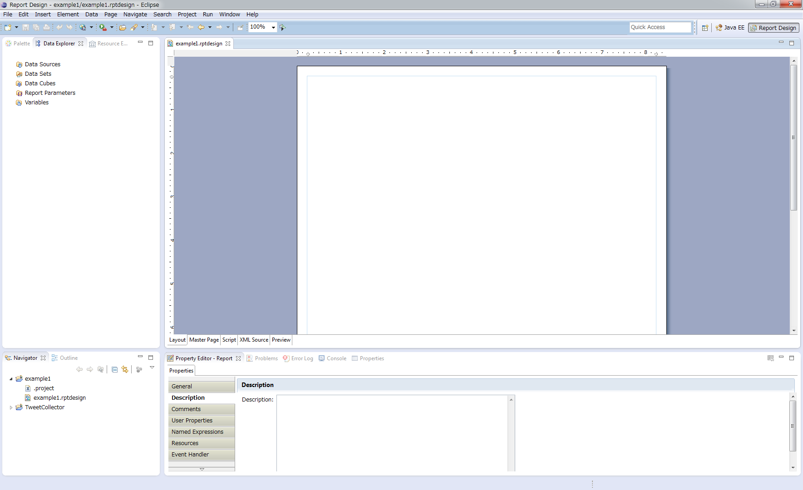
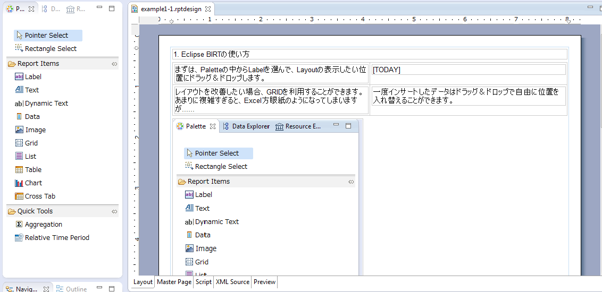
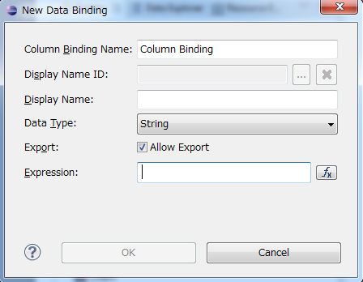
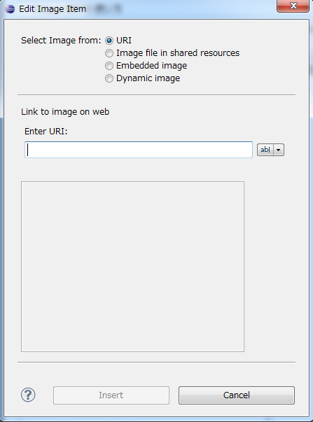
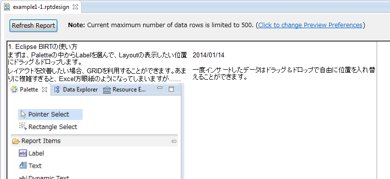
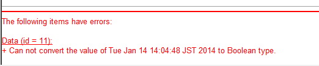
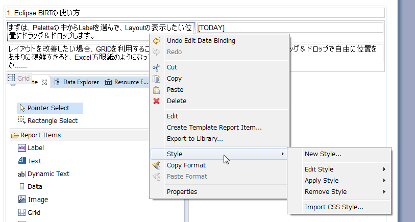
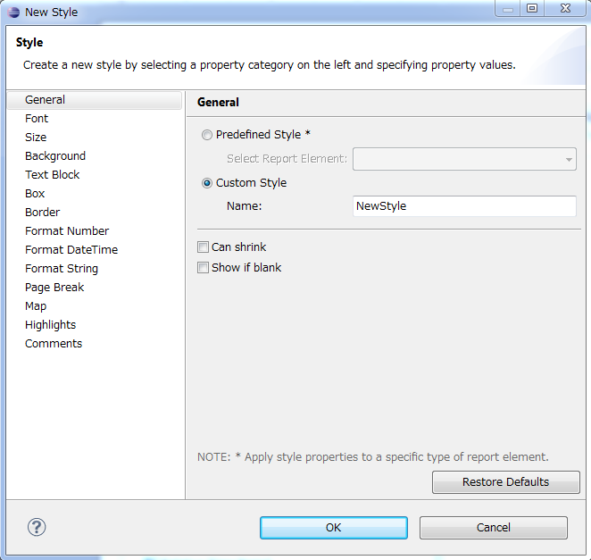
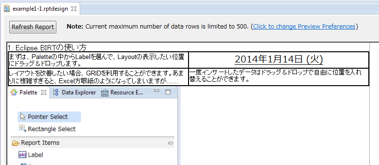
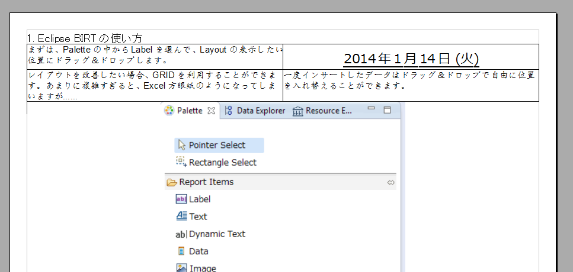

############################################
Eclipse BIRTの導入と基本動作
############################################

1. はじめに
===============================

業務上、既にあるデータを基にしたレポートや帳票を作成したいことがある。
このようなツールはビジネスインテリジェンス(BI)ツール、あるいはレポーティングツールなどと呼ばれている。
有名な有償アプリケーションに `Crystal Reports`_ があり、様々な場面で利用されている。

このジャンルをオープンソースで行うプロジェクトとしてBIRT(Business Intelligence & Reporting Tools)プロジェクトがある。
BIRTはEclipseファウンデーション内のソフトウェアプロジェクトの１つであり、
Java EEに基づいたアプリケーションにビジネスインテリジェンス機能とレポーティング機能を提供している。
現在でも開発が続けられており、様々なデータソース(例えば、Cassandraなどからもデータを読み出せる)に対応している。

本稿の目的は、実際にEclipse BIRTを使った上で得た知見を書き残すことである。
(特に、日本語での資料は古いものが多く、新しい機能を網羅していないため)

また、BIRTプロジェクトがJavaで書かれているので、これを拡張することもできるが、
本稿では「プログラムを書かずに利用できる範疇」での内容を記述する。

.. _`Crystal Reports`: http://crystalreports.jp/

2. Eclipse BIRTの特徴
===============================

Eclipse BIRTがビジネスインテリジェンスツール、あるいはレポーティングツールとして
備えている機能、あるいは特徴を以下に述べる。

- Eclipse上に設計されたデザイナを利用してレポートの雛形を作成できる
  (そのため、マルチプラットフォームでのレポートの作成が可能)
- 作成されたレポートの雛形はXML形式であり、手作業での修正も可能
- 様々なデータソース(データベースやCSV形式のテキストなど)を基にしてレポートを作成できる
- JavaEEの上で動作させることができるランタイムがある
  (例えば、Tomcatとランタイムを利用して、レポートを生成・ダウンロードするサーバーを立てることができる)
- 様々な形式でレポートを出力できる
  (例: doc, xls, docx, xlsx, pdf, odt, odsなど。ただし後述する通りレイアウトが崩れることがある)
- ライセンスはEclipse Public License
  (改変・修正する場合は修正箇所のソースの明示が必要/商用利用可能)

様々な形式でレポートを出力することができるが、
レポートの形式次第では出力レイアウトが大きく崩れてしまう。

これを解決する方法は **ODT(OpenDocumentText)形式** で出力する方法がある。
ODT形式で出力されたデータが最もデザイナの画面に忠実な形式で出力される。

その他の形式を試した限りの情報は以下の通りである。

.. list-table:: 表2-1. 出力形式とレイアウトの再現率
   :header-rows: 1
   :widths: 30 20 50

   * - 形式
     - 再現率
     - 補足
   * - ODT (OpenOffice Writer用)
     - ◎
     - 最も再現率が良く、複雑なレイアウトにも対応できる
   * - ODS (OpenOffice Calc用)
     - ○
     - セルの都合から、グリッドのサイズを意識しないとレイアウト崩れが起きる。
       また **数式を埋め込むことはできない**
       (BIRTはレポーティングツールであり、出力結果 = 集計済みの結果であるため)
   * - PDF形式
     - ○
     - ODSと同様に、グリッドのサイズを意識する必要がある。
       また、Windows7 + Eclipse BIRT 4.3の環境では起動できなかった
       (Linux + Tomcat + v4.3 Runtimeでは動作した)。
   * - DOCX/XLSX形式
     - △
     - DOC/XLSに比べるとまだましだが、複雑なレイアウトに対応できない
   * - DOC/XLS形式
     - ×
     - 単純な列挙であれば対応できるが、表組みなどがある場合は上手く動かない

以上の結果から、レポートに修正が必要な場合はODT/ODS形式に、
修正が不要な場合はPDF形式にするのが良さそうである。

3. Eclipse BIRTの準備
===============================

開発環境を利用する場合は、BIRTのデザイナが組み込まれたEclipseが配布されているので、
これをダウンロードして利用すると良い。

**(2014/1/14時点の最新Ver) BIRT4.3.1 のダウンロードの手順**

1. `BIRT Project公式ページ`_ に移動する
2. "Download BIRT 4.3.1" のボタンを押す
3. Choose a Desiner Downloadの行から、"All-in-One"のボタンを押す
4. ページの右側にDownload Linksがあるので、自分の環境に合わせたリンクを選ぶ
5. "Eclipse donwloads"ページに飛ぶので、中央にある緑色の下矢印ボタンを押してダウンロードを行う
6. ダウンロードしたファイルを好みの位置に展開する

4. 基本的な使い方
===============================

4.1. レイアウトの説明
-------------------------------

Eclipse BIRT Designerを開くと、以下のような画面が表示される。
(Eclipseなので、画面のデザインは自分の好みでカスタマイズ可能)

良く利用するタブと、その役割は以下の通りである。

.. list-table:: 表4-1. 画面の説明
   :header-rows: 1

   * - 画面
     - 説明
   * - メイン画面(右上)
     - デザイナのメイン画面。
       この画面上の要素を選択、編集、ドラッグなどすることでレポートの雛形を編集する。
       
       左下にLayout, Master Page, Script, XML Source, Previewがあるが、それぞれ以下の役割を持つ。
       
       - Layout: 通常のデザイナ。GUIベースの操作を行う画面。
       - Master Page: レポート全体の設定を行う。用紙サイズや余白の調整など。
       - Script: レポートの要素を判定するプログラムを記述できる。本稿では扱わない。
       - XML Source: デザイナが生成した生のXMLソースを編集できる。Layoutでは面倒くさい細かい作業を行うのに使うと便利。
       - Preview: 実際のデータソースを読み込んだプレビューを行える。ただし、幾つかの条件でレイアウトが崩れる(きちんと出力すると直っている)。
       
   * - Navigator(左下)
     - 今開いているEclipseで管理しているプロジェクトが表示される。
       ファイルの追加などは、この画面の右クリックからが便利
       (普段利用しているEclipseと同様の作業が可能)。
   * - Data Explorer(左上)
     - このレポートで利用する変数関連の設定を行う。
       例えば、以下のような設定ができる。
       
       - データソース(レポート用のデータの取得元)を設定
       - 取得するデータの形式定義(例えば、DBに対するSQLを書く）
       - レポート全体で利用する変数の定義
       - レポートを生成するときに利用する引数の定義
       
   * - Palette(左上、画像では隠れている)
     - タブを開くと以下のようになっている。
       
       .. image:: image/palette.png
       
       基本的にはReport Itemsの内容をメイン画面のLayoutにドラッグ＆ドロップすることで要素を追加する。
   * - Property Editor(右下)
     - 現在Layoutで指定している要素やMaster Pageを選択したときなどに、情報を編集することができる。

4.2. プロジェクトの作成
-------------------------------

ダウンロードしたEclipseを開いたら、まずはBIRTのプロジェクトを作成する。

- "ツールバーのFile > New > New Project > Business Intelligence and Reporting Tools > Report Project" を選択してNextを押す
- プロジェクト名とプロジェクトを保管する場所を決定する
- "finish"を押してプロジェクトを作成する

なお、ここで作成されるプロジェクトはEclipseのプロジェクトなので、
他で作られたプロジェクトの場合はImportすることもできる。

("ツールバーFile > Import > Existing Projects into Workspace"を選び、他で作られたプロジェクトを指定する)

ここで作成・追加したプロジェクトはNavigatorタブに表示される。

5. レポート作成の基本
=======================================

この節では、example1/example1-1.rptdesign を作成する手順を紹介する。
ここでは、以下の要素を扱う。

- 要素の追加、レイアウトの編集について
- 静的画像の追加について
- 動的リソースの配置について
- フォントやスタイルの編集について

5.1. 要素の追加
---------------------------------

左の要素から、実際に使いたいデータをドラッグしてくる。
良く使う静的な要素としては、以下のものがある。

- Label: レポート上の固定文字列を使う場合に利用する
- Data: レポート上でJavaやJavaScriptを利用した動的文字列を作るために利用する
  また、データソースを利用したテキスト表示にも利用する(後述)
- Image: レポート上に画像を表示する場合に利用する
- Grid: レポート上に表組みを利用したい場合、もしくは表組みを利用したレイアウトを使いたい場合に利用する

なお、実際に利用してみたところ、レイアウトが崩れることが多かったため以下の要素については利用を推奨しない。
(※あくまで、著者が利用した範囲では、である。ODTやODSと相性が悪い？)

- Text: レポート上にHTMLの装飾ありで固定のテキストを記述する場合に利用する。
- Dynamic Text: JavaやJavaScriptを利用して、動的なテキストを生成できる。
  同様のことがDataでもできるので、そちらを利用する。

5.2. マスターページの編集
----------------------------------

Master Pageのデフォルト設定は以下のようになっている。

1. ページのフッタに左寄せでレポート出力記述が出力される
2. 用紙サイズがUS Letterに設定されている

フッタの要素を消すには、デザイナで要素を選択して消せばよい。

用紙サイズを変えるには、"PropertyEditor > Properies General > Type" から選択する
(日本なら、おそらくA4が妥当)。

**事前に具体的なサイズを指定したレイアウトを行っていた場合、それらのレイアウトにも関係がでるので、最初にレイアウトを変更しておくこと。**

5.3. 要素の編集
---------------------------------

デザイナ上に追加した後は、ダブルクリックや右クリックでそれぞれの要素の編集を行える。
例えば、LabelやDataであれば、内容の変更。グリッドであれば行の追加・削除などである。

LabelやGridについては、デザイナで触ってみれば分かると思うので説明を省略する。
唯一、デザイナ上でのGridの選択が難しいが、LayoutのGrid部分をマウスオーバーすると
左下に"Grid"というアイコンがポップアップするので、それをクリックするとよい。

5.3.1. Dataの編集(Local要素)
^^^^^^^^^^^^^^^^^^^^^^^^^^^^^^^^^^

Dataをドラッグ＆ドロップして挿入すると、以下のようなウインドウが表示される。

これは、それぞれ以下の意味を持つ。

.. list-table:: 表5-1. Local要素の説明
   :header-rows: 1

   * - 要素名
     - 説明
   * - Column Binding Name
     - このDataオブジェクトの識別子。基本的にはDisplay Nameと同じ内容を推奨。
   * - Display Name
     - 画面上に表示される名前。このプロジェクトではTODAYと記載した。
   * - Data Type
     - この出力がJavaのどの型として扱われるか。
       基本はString, Decimal, Float, Integer, Dateなどを扱う。
       ここではDateを指定した。
   * - Expression
     - この出力がどのような式で出力されるか。
       JavaとJavaScriptを混在した式が書ける。
       ここで出力した型がDataTypeで指定した内容と一致する必要がある。
       詳しい活用については後述する。
       
       ここでは"new Date()"とだけ記載した。

5.3.2. Imageの編集(Local要素)
^^^^^^^^^^^^^^^^^^^^^^^^^^^^^^^^^^

Imageをドラッグ＆ドロップして挿入すると、以下のようなウインドウが表示される。

レポート出力で使うことが想定されるのは、
レポート出力システムと同一のコンピュータ上にある画像をレポートに出力することである。

この場合、"Image file in shared resources"を選択して、画像のパスを入力する。
相対パスと絶対パスが利用できる。相対パスはプロジェクトのパスをカレントディレクトリとしたものである。

そのため、example1-1の場合は、image/example1-1.pngと指定することでプロジェクト内の画像を表示できる。

5.4. プレビュー
-----------------------------------

メイン画面の"Preview"タブを押すと、現在の状況のレポートをプレビューした結果を見ることができる。
プレビュー前に現在編集中のファイルを1度保存した後、レポートのプレビューを出力する。
今回の場合は、以下のようなプレビュー画面が表示される。

何らかの問題がある場合は、プレビュー結果の一番下に赤色の文字でエラー内容が表示される。
エラーの例を以下に示す。

この場合、Data TypeとしてBooleanを選んでいるが、出力結果がBooleanに変換できない旨のエラーが表示されている。

5.5. 装飾
-----------------------------------

レポートの見栄えをよくするために、以下のことを行いたいことがある。

- 文字のフォントを適切に変更したい
- 出力データのフォーマットを整えたい
- グリッドに線を引いて、表であることを強調したい

これらは、BIRTのStyleを使って行う。
Styleは個別に定義し、複数のオブジェクトに使いまわすことができるが、
1つを変更すると全てを変更することになるため、扱いには注意すること。

5.5.1. Styleの編集
^^^^^^^^^^^^^^^^^^^^^^^^^^^^^^^^^^

"要素を右クリック > Style" を押下することで、その要素に対するスタイルをどのようにするかを選択できる。
各オブジェクトにStyleは1つ(あるいは0個)しか設定できないので注意すること。

新しいスタイルを作りたい場合は、New Styleをクリックすることでスタイルを作成できる。

**また、文字に対してフォントを指定しない場合、PDF/ODTにおいてプレビュー時とは異なるフォントが選択される**
ため、基本的にフォントは指定すること。

スタイルを編集する場合、編集用のウインドウが開くので、その内容を編集する。

スタイルで対応できることと具体的な方法を以下に示す。

.. list-table:: 表5-2. スタイルで対応できることとその方法
   :header-rows: 1

   * - やりたい事
     - 方法
   * - スタイルの新規作成・命名変更:
     - General > Custom StyleのNameを変更する
   * - 文字フォントの変更
     - Fontから内容を変更する。
       フォント、大きさ、文字色、装飾(太さ、イタリック、下線など)がここで編集できる。
   * - 文字列の左・中央・右寄せ
     - Text Block > Text alignmentのLeft, Center, Rightを選択
   * - 枠線の設定
     - Borderを選択し、上下左右のLineStyle, Color, Width(太さ)を選択する
       (※Gridに枠を設定する場合の注意点は後述)
   * - 数値・日付のフォーマット
     - Format Number, Format DateTime, Format String から元データに応じたフォーマットを選択。
       幾つかテンプレートのフォーマットがあるが、合わない場合はCustomを選択する。
       
       フォーマットの記載方式は、java.text.DecimalFormatとjava.text.SimpleDateFormatのフォーマットを参照のこと。
       また、Localeが必要な場合にはLocaleを指定すること。

5.5.2. Style適用の注意点
^^^^^^^^^^^^^^^^^^^^^^^^^^^^^^^^^^

スタイルは **指定した要素** 及び、その子に適用される。
子が親と異なるスタイルを持っていた場合、子は子に設定されているスタイルを利用する。

LabelやDataについては、１つの要素で構成されるが、GridやTableは複数の要素で構成されている。
(要素の構成状況は、XML Sourceのid属性を見ることで分かる)

例えばGridは以下の構造で構成されている。

- grid: グリッドそのもの
  
  - column: 列の各情報
  - row: 行の各情報
  
    - cell: セルの各情報
    
      - セル内のアイテム(label, dataなど)

ここでExcelのように各セルの要素に枠線をつけようと思った場合、
**cellの要素に逐一borderの要素を設定する必要がある。**

このような処理を行う場合は、XML Sourceを直接編集すると楽である。
具体的な手順は以下の通り。

1. 四方を線で囲うstyle(cell-border)を作成する
2. LayoutでGridを選択する
3. その状態でXML Sourceを選択する
   
   (要素が選択された状態だと、その要素の位置にエディタを開いてくれる)
4. cellタグの中に"<property name="style">cell-border</property>"を入れる
   
   (<cell id="xx"/>となっている場合、<cell id="xx"></cell>と変形して中に入れる)
5. Layoutに戻る(戻るときに保存するか聞かれるので、保存するを押す)

なお、インデントなどは保存時にEclipseが適切に変更してくれるので気にしなくても良い。

5.5.3. Style適用の具体例
^^^^^^^^^^^^^^^^^^^^^^^^^^^^^^^^^^

example1-1では、以下のStyleを作成・適用した。

- section-label: 日本語の"ＭＳ Ｐゴシック"を指定したスタイル
- date-center-format: 日付を "YYYY年M月D日(E)" とするフォーマットに幾つかのテキスト装飾・センタリングを行ったスタイル
- cell-border: cellの四方をThinの線で囲うスタイル

プレビューの結果が以下の通りである。

5.6. レポートへの出力
----------------------------------

Eclipseからもレポート形式への出力を行うことができる。
Previewではレイアウトが崩れていることもあるので、
実際に出力したい形式に出力しないかぎり、
自分が作成したレポートがどのように出力されるかが分からないので注意する。

**そのため、こまめに自分が欲しい形式のレポートへの出力を行い、大きなズレがないかを確認しておくと良い。**

レポートへの出力方法は以下の通りである。

"ツールバーのRun > View Report > As [出力したいレポートの形式]" をクリックする。

実際にODT形式に出力した場合、以下の結果が得られた(開いたのはOpenOffice 4.0.0)。

装飾の項でも指摘したとおり、styleでfontを指定しなかった部分がプレビューとは異なるフォントになっていることが分かる。

6. おわりに
==============================

ここまでにEclipse BIRTの基本的な使い方と簡単なレポートの出力方法についてを学んだ。
別章では、具体的なデータソースの取り扱いについてや、より細かなレイアウトの指定についてを学ぶ。

参考文献
==============================

- `BIRT Project公式ページ`_
- `Wikipedia - BIRTプロジェクト`_

.. _`BIRT Project公式ページ`: http://www.eclipse.org/birt/phoenix/
.. _`Wikipedia - BIRTプロジェクト`: http://ja.wikipedia.org/wiki/BIRT%E3%83%97%E3%83%AD%E3%82%B8%E3%82%A7%E3%82%AF%E3%83%88

