############################################
Eclipse BIRTによる動的レポートの生成
############################################

1. はじめに
===============================

本章では、BIRTを利用してデータソースを読み込み、動的なレポートを生成する方法を述べる。
また、細かいレイアウトを指定する方法について説明する。

2. 作成するシステム
===============================

2章と3章とを使い、Tweet-Collectorというシステムを作成することを考える。
このシステムの仕様は以下の通りである。

- Tweet-Collectorは一定時間ごとにTwitterをある単語(キーワード)で検索し、それをデータベース(MySQL)に保持する
- データベースの内容をPDF形式で吐き出すことができる
- PDF形式で吐き出す場合に、吐き出す期間を指定できる

この内、データを収集して保存する部分は今回は割愛する。
(データベースにはレポートを出力するために十分なデータが既に入力されているものとする)

3. データベースの内容
===============================

今回のシステムのデータベース(スキーマ)名はtweet_collectorとする。
レポート表示に用いるテーブルは以下の2つである。

- "search"テーブル: 検索の履歴を保持する
- "result"テーブル: 検索結果を保持する

これらのデータベースとテーブルは以下のSQLで作成される。

(※サンプルなのでDB設計の良し悪しには言及しない方向でお願いします。)
::

  create database tweet_collector default character set utf8;
  
  use tweet_collector;
  
  create table search (
      SEARCH_UUID char(36) NOT NULL -- 検索実行時に発行されるUUID
    , TIME timestamp NOT NULL       -- 検索の実行時間
    , KEYWORD varchar(255) NOT NULL -- 検索を行ったキーワード
    , PRIMARY KEY(SEARCH_UUID)
  );

  create table result (
      SEARCH_UUID char(36) NOT NULL -- 検索実行時に発行されるUUID
    , SORT_ORDER integer NOT NULL   -- 結果の表示順序
    , MESSAGE varchar(255) NOT NULL -- 検索したツイートの内容
    , PRIMARY KEY(SEARCH_UUID, SORT_ORDER)
  );

  

このシステムの検索部分はこのテーブルを次のように活用する。

- 検索を一度実行したら、データの取得の有無に関わらずにsearchテーブルに検索した事を登録する
- 検索結果はresultテーブルに登録される。searchとresultとの結びつけはSEARCH_UUIDである
  (話を単純にするため外部キーを貼ってないが、外部キーを貼る設計としても差し支えない)

4. MySQL Data Sourcesの利用
===============================

この節では、外部のデータソースをBIRT内で利用する方法を説明する。

また、MySQLの設定については解説しないが、以下の状況を仮定する
(必要によっては適時読み替えて進めること)。

- MySQLがlocalhostにインストールされている
- ポートはデフォルトポート(3306)を利用するものとする
- tweet_collectorデータベースが作成されている
- tweet_collectorにアクセスできるユーザー/パスワードの組がある

今回はテスト環境として、以下のSQLでユーザー/パスワードを作成した。

::

  grant all privileges on tweet_collector.* to tweet_collector@'localhost' identified by 'tweet_tweet_collector' with grant option;

4.1. Connector/Jの準備
-------------------------------

BIRTでMySQLを使う場合、JDBC Driver(Connector/J)が必要になる。
以下の手順で先にjarファイルをダウンロードしておくこと。

1. `Connector/Jのダウンロードページ`_ にアクセスする
2. Select Platformで "Platform Independent" を選択する
3. 必要なArchiveをダウンロードする(zipでもtarでもどちらでも良い)
4. Archiveを解凍し、jarファイルをどこかに配置しておくこと

.. _`Connector/Jのダウンロードページ`: http://dev.mysql.com/downloads/connector/j/

4.2. データソースの準備
-------------------------------

まずはデータソースを定義する。

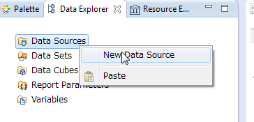

"Data Explorer > DataSourcesを右クリック > New Data Source" を選択してDataSourceの定義ウインドウを開く。

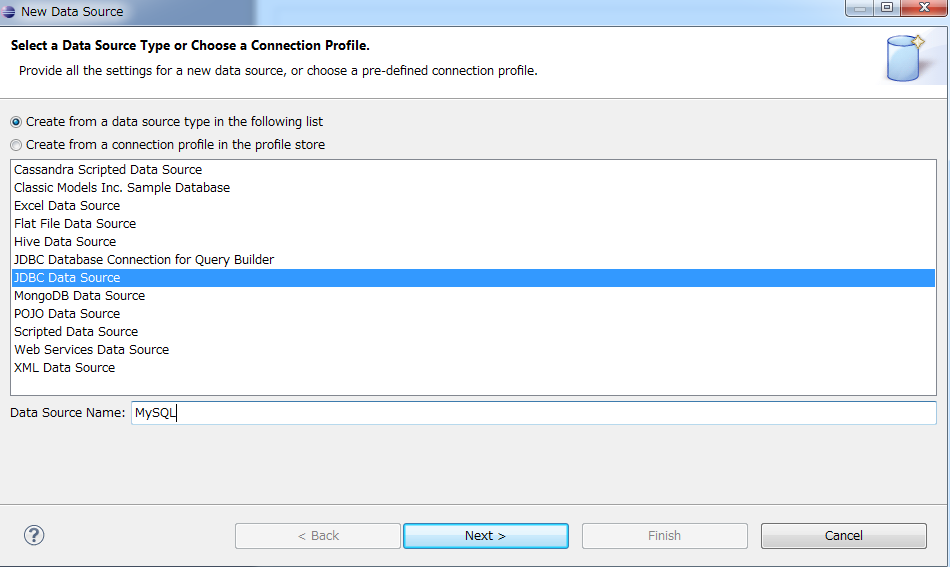

BIRTで利用できるデータソースとして、上記ウインドウに示してあるデータが利用できる。
ここでは、MySQLのデータを使うので、JDBC Data Sourceを選択して、Data Source NameをMySQL(任意)とする。

選択後、Nextを押すと、次のようなJDBCの接続設定を行う画面が現れる。

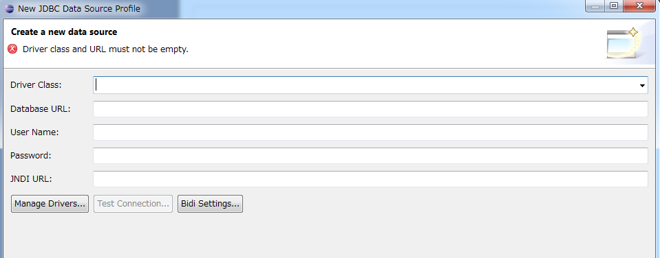

初回のみ、Connector/Jのjarファイルにパスを通す必要がある。
以下の手順で4.1.で展開したjarファイルにパスを通す。

1. 画面左下の"Manage Drivers"ボタンを押す
2. JAR Filesタブ内のAddボタンを押す
3. 小節4.1.で解凍したjarファイルを選択し"開く"を押す
4. 中央のテーブルに新しく行が追加されたことを確認して、OKボタンを押す

上記の設定後、Driver Classのコンボボックス内に"com.mysql.jdbc.Driver"が増えているはずなので、それを選択する。

その後、URL, UserName, Passwordを設定し"Test Connection"ボタンを押す。
成功した場合、"Connection successful"というウインドウが表示される。
今回仮定した環境の場合、入力は以下のようになる。

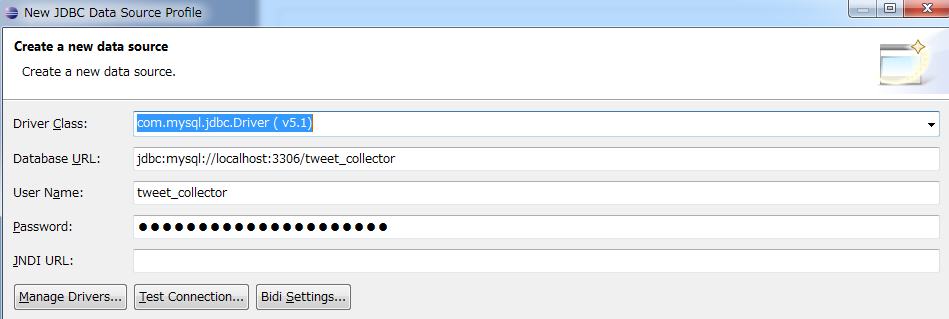

"Connection successful" の状態でFinishを押すことで、このレポートで利用するデータソースを定義できる。

**補足: 別環境への導入**

今回はlocalhost向けの設定を行ったが、開発DB環境と本番DB環境が異なる場合が普通である。

そのため、別の環境で使うためにはどのようにすればよいのか疑問に思った人もいるはずなので、簡潔に答えを書いておくと、
この設定は全てXML Source内に記述されているので、そこを書き換えることで対応できる。

開発と本番環境を切り分けるには、テスト時内容と完全一致のsedを記載する、
Chefなどのテンプレートビルドによるデプロイなどで環境の違いを吸収する方法が考えられる。

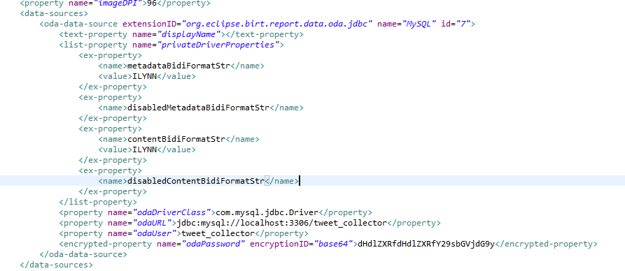

4.3. データセットの定義
-------------------------------

小節4.2.で設定したデータソースから、どのようなデータを取得するかを設定する。

"Data Explorer > Data Setsを右クリック > New Data Set"をクリックし、どのデータソースからデータを取得するかを選ぶ。
先ほど登録したMySQLがあるので、これを選び、Data Set Nameに適切な名前(ここでget-allと名づけた)をつけてNextをクリックする。

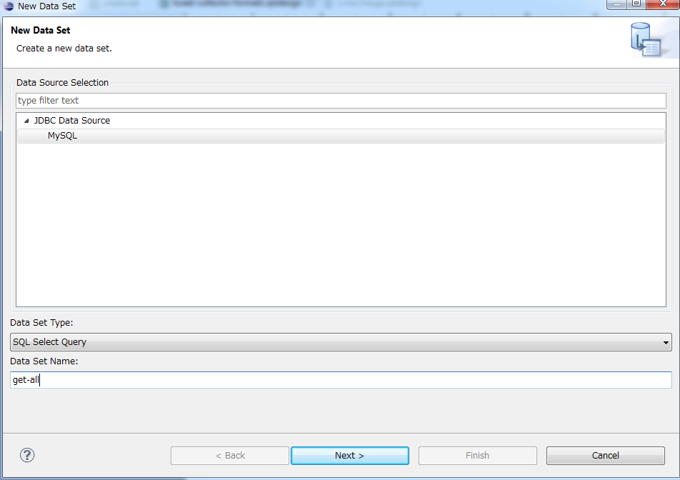

次に進むと、DataBaseからどのような情報を取得するかのSQLを書くように指示される。
ここでは単純に全データを取得するSQLを記載する。

なお、記述にあたり、画面左のテーブル・カラム情報をドラッグアンドドロップすることで、多少記述が楽になる。

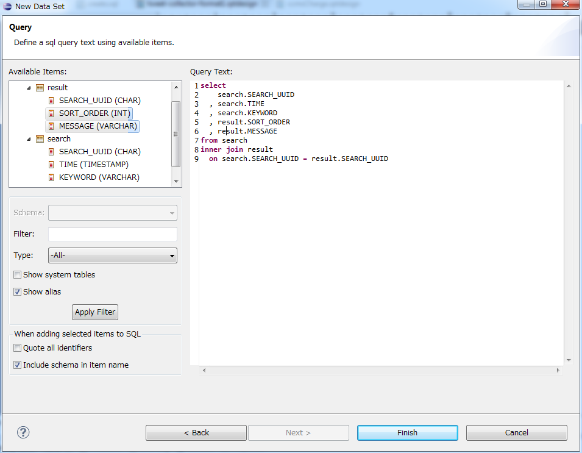

SQLを記述して"Finish"を押すと、下記のEdit Data Setのウインドウが開く。
ここでは特に何もせず、OKボタンを押す。

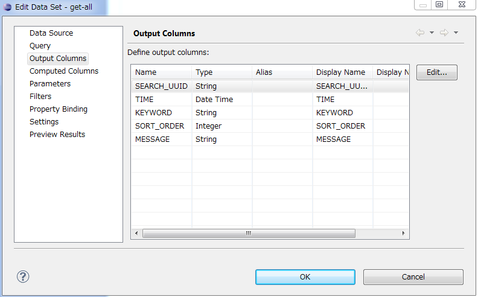

すると、Data Explorerの中のData Sets内に"get-all"という名前のデータセットが追加されているはずである。

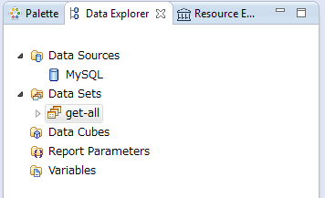

4.4. データセットの利用
-------------------------------

このデータセット"get-all"をLayout内にドラッグ＆ドロップすると、取得した行全てを表示するテーブルが作られる。

あとはほぼグリッドと同様の方法で行・列を編集することができる
(なお、テーブルとグリッドの違いはデータセットを繰り返す構造かそうでないか。テーブルは繰り返す、グリッドは固定)。

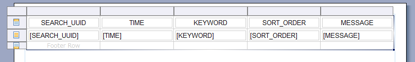

単純なデータを入れてPreviewを見ると、データベースからデータを取得してレポートに表示できていることが分かる。

::

  insert into search (SEARCH_UUID, TIME, KEYWORD) values ('965a3b14-7d07-11e3-84fc-782bcb93b38f', '2014/1/14 19:35:00', 'テスト');
  insert into search (SEARCH_UUID, TIME, KEYWORD) values ('b8af083a-7d07-11e3-84fc-782bcb93b38f', '2014/1/14 19:35:01', 'study');

  insert into result (SEARCH_UUID, SORT_ORDER, MESSAGE) values ('965a3b14-7d07-11e3-84fc-782bcb93b38f', 0, '明日は期末テスト');
  insert into result (SEARCH_UUID, SORT_ORDER, MESSAGE) values ('965a3b14-7d07-11e3-84fc-782bcb93b38f', 1, 'テスト＼(^o^)／');

  insert into result (SEARCH_UUID, SORT_ORDER, MESSAGE) values ('b8af083a-7d07-11e3-84fc-782bcb93b38f', 0, 'I love study');
  insert into result (SEARCH_UUID, SORT_ORDER, MESSAGE) values ('b8af083a-7d07-11e3-84fc-782bcb93b38f', 1, 'I hate study');
  insert into result (SEARCH_UUID, SORT_ORDER, MESSAGE) values ('b8af083a-7d07-11e3-84fc-782bcb93b38f', 2, 'study, study, study ... Oops!! ');

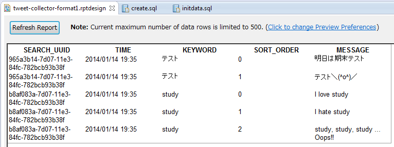

ここまでの成果はTweet-Collector/tweet-collector-format1.rptdesignに記述されている。

5. Sub-Group Layout
===============================

テーブルから不要な列を削除しスタイルの調整を行うことで、
以下のような結果を得ることができるようになった。

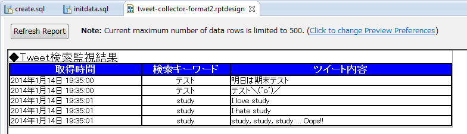

しかし、取得時間や検索キーワードについては各行に同じ情報が出力されており、
これをまとめて表示することで、レポートの質を上げたい。

データセットの結果を集約する方法にGroupという概念があるため、それを説明する。

5.1. Group
--------------------------------

テーブルには、Header, Detail, Footerという概念がある。
下図の一番上の行がHeader, 一番下の行がFooter, そして真ん中のコンテンツを表示する行がDetailである。

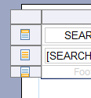

TableのDetailの行のどこかにはDataが入っている必要がある。
Data Setからドラッグ＆ドロップしてきた場合は、適切なデータセットにバインドされたテーブルを作ってくれるので、
これを編集すると楽である。

さて、Detailを右クリックすると"Insert Group"という内容が出てくるので、これをクリックする。
すると、以下の用に「データをグループ化する条件設定」のウインドウが出てくるので、以下の設定を行う。

- NameをKeywordGroupに設定する
- Group OnからKEYWORDを設定する
  (これで、同じキーワードの要素がグループ化される)
- SortingからAddを選び、KeyにTIMEとSORT_ORDERを選ぶ。
  (グループ化した後の表示の並び順を決める)

設定を行うと、以下のような表示になるので、OKを押す。

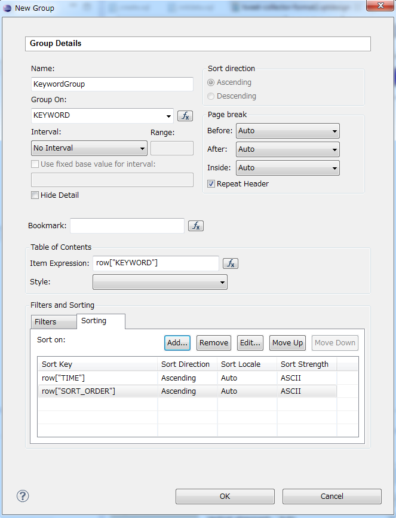

すると、Detail内にさらにもう一段ネストした形でGroupが現れる。

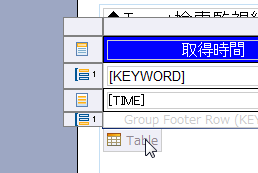

これを編集し、Groupごとの表示を行うようにするには、以下の処理を行う。

- 検索キーワードの行を削除する
- subheaderのData [KEYWORD]をダブルクリックし、Expressionを "キーワード: " + dataSetRow["KEYWORD"] に変更する。
- Data [KEYWORD]の行をマージする
  (方法: 右のセルを選択後、Shiftを押しながら左キーを押し、"右クリック > Merge Cells"をクリック)
- subheader用のstyleを作成し、subheaderに適用する
- subheader内のcellにcell-borderを適用する
- subfooterを削除する

以上の処理を行うと、次のようなレポートが生成される。

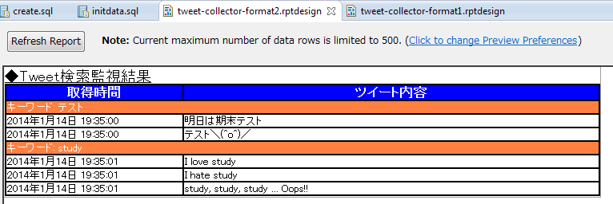

これはネスト(GroupのGroupを使う、など)することもできる。

5.2. 集約関数
--------------------------------

サブグループ化が行われたのであれば、(SUMやCOUNTなどによる)集計を行ってレポートに表示したい。

これも、テーブル内のデータに用意された集約関数を利用すれば実現できる。

以下の手順で新しいデータ/集約条件を追加する。

1. テーブルを選択し、"Property Editor > Binding"タブを開く
   (補足: 上手く表示されない場合ケースがあったので、その場合はファイルを閉じて開きなおしてみてください)
2. 右のボタンの"Add Aggregation"を選択する
3. 集約条件を設定する。
   ここでは、以下の条件を設定している。
   
   - データ項目名・表示名は "KEYWORD_COUNT"
   - 集約関数はCOUNTで、戻り値はInteger型
   - COUNTの項目はKEYWORD列
   - 計算はKeywordGroupごとに行う
     (全体の計算を行いたい場合はTableを指定すればよい)

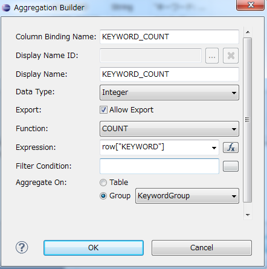

4. 集約条件を使う場合、DataをInsertしてrow["KEYWORD_COUNT"]を指定する
   (Expressionの"fx"内から選択することも可能。下図を参考)

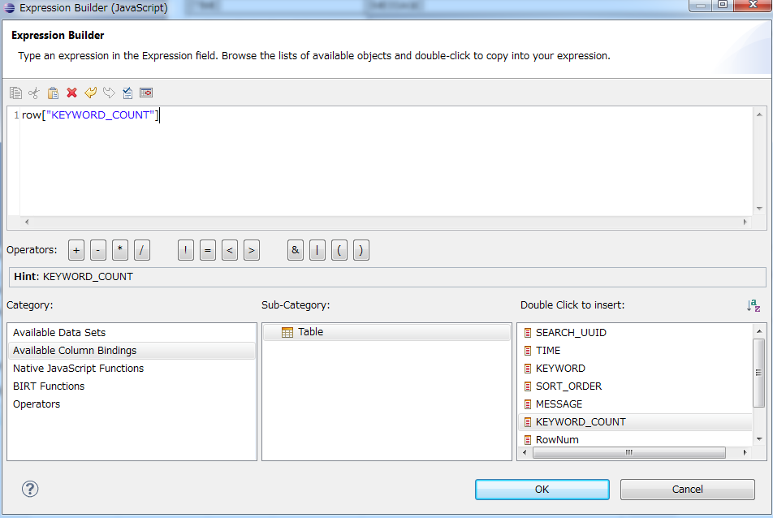
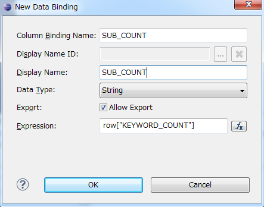

以上の集約結果を利用して、サブコマンドを編集すると、以下の結果が得られる。

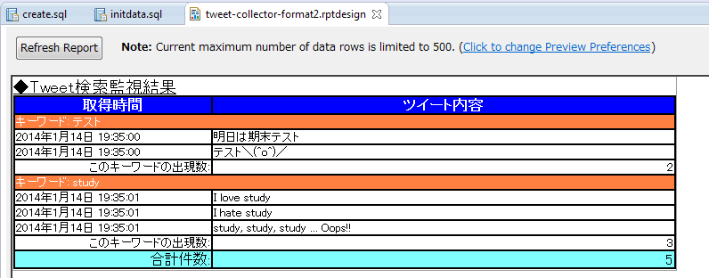

ここまでの成果はTweet-Collector/tweet-collector-format2.rptdesignに記述されている。

参考文献
==============================

- `BIRT Project公式ページ`_
- `Wikipedia - BIRTプロジェクト`_

.. _`BIRT Project公式ページ`: http://www.eclipse.org/birt/phoenix/
.. _`Wikipedia - BIRTプロジェクト`: http://ja.wikipedia.org/wiki/BIRT%E3%83%97%E3%83%AD%E3%82%B8%E3%82%A7%E3%82%AF%E3%83%88

